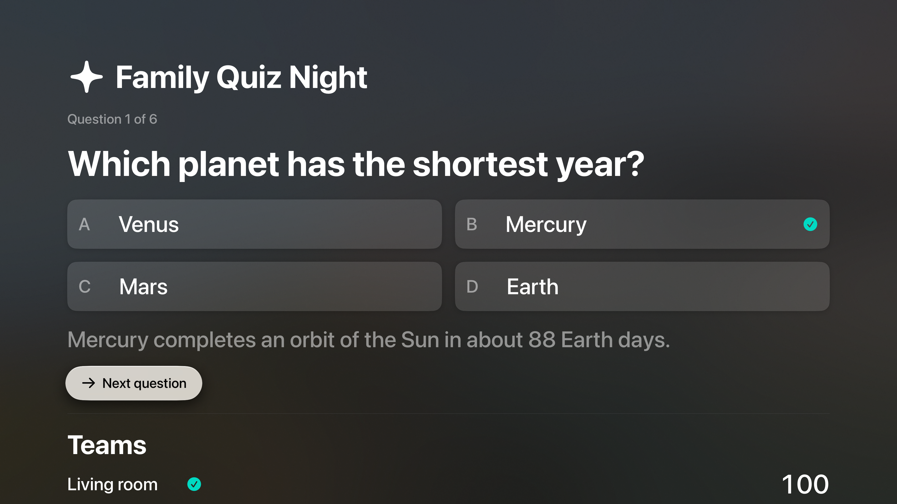
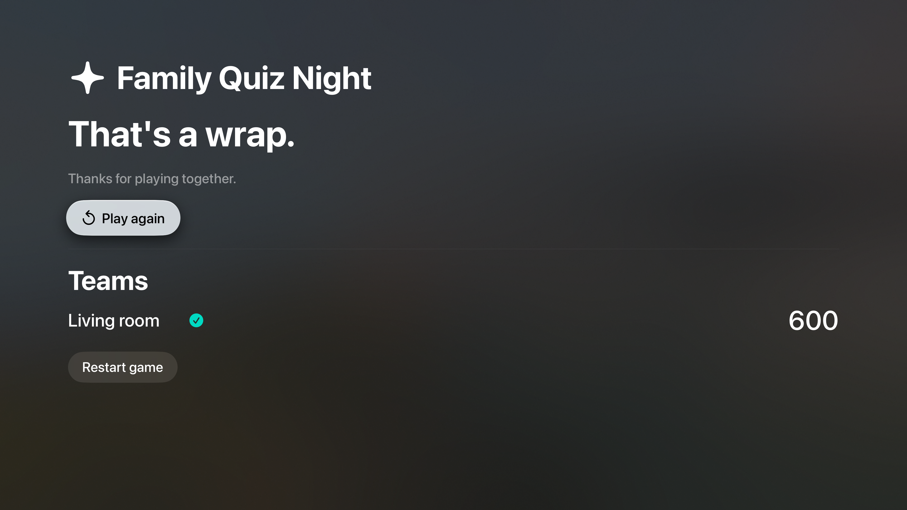

# Family Quiz Night

An Apple TV quiz host with iPhone and iPad team controllers. Play together on a local Wi-Fi network or use the Siri Remote for a single living-room team.

## Preview

Native tvOS 27 simulator captures from a complete six-round remote game.





## Run

Open **Family Quiz Night.xcodeproj** in Xcode 27. Choose **Family Quiz Night** for Apple TV or **Family Quiz Controller** for iPhone/iPad. Both apps target OS 27. Bundle IDs are `com.dd.familyquiznight` and `com.dd.familyquiznight.controller`. Select your own development team for physical devices; no signing account is included.

On TV, choose **Invite phone controllers**. On each phone, enter a team name and the six-digit code displayed on the TV, choose **Find local rooms**, then select the room. Allow Local Network access when the system asks. Up to eight teams can join before the first question. The host controls when rounds start and when revealed answers advance.

**Play with the remote** starts a game immediately. Choose an answer using the native focus controls. Each correct answer earns 100 points; speed does not change the score. The default game has six twenty-second rounds. Twelve original questions and explanations are included in the source deck.

## Game behavior

The host owns the clock, accepted answers, and scores. Controllers receive choices and answer acknowledgements; the correct answer and updated score are revealed after every team answers or the timer expires. Late, duplicate, and previous-round answers cannot earn points.

A disconnected controller can tap **Reconnect** while its app remains open. Its session token restores the same team, accepted answer, and score. Leaving the room or terminating the controller creates a new team identity; new teams cannot enter an active game. Games stay in memory and end when the host terminates. Restarting clears scores while retaining joined teams.

## Engineering

Swift 6 complete concurrency, main-actor observable UI state, monotonic `ContinuousClock` deadlines, native SwiftUI focus navigation, semantic text styles, and cancellable connection tasks with generation guards. Modern Network framework `NetworkListener`, `NetworkConnection`, and `NetworkBrowser` APIs provide TCP transport and Bonjour discovery.

Messages use a four-byte length prefix and bounded JSON payloads. The receiver reads exact frame lengths, limits payloads to 32 KiB, validates snapshots, and rejects unexpected requests. Connection handlers enforce the room code, team limit, session identity, and question identity. Connection sends await backpressure instead of accumulating an unbounded broadcast queue.

The room code controls admission; the local TCP protocol is unencrypted. Use a trusted network and ordinary team nicknames. This app has no Internet matchmaking, accounts, chat, analytics, advertising, purchases, or external dependencies. It is not an anti-cheat system for competitive games.

## Verify

```sh
swift test
swift test -c release
bash Scripts/test-ui.sh tvOS
bash Scripts/test-ui.sh iOS
```

Core tests cover scoring, time boundaries, duplicate and stale answers, reconnection identity, bounded decoding, and an actual loopback transport exchange. The TV UI workflow plays a complete remote-only game; the phone UI check covers the native controller entry screen without accepting permissions. Multi-device Bonjour discovery and reconnection still require physical LAN checks.

See [verification](Docs/Verification.md), [privacy](PRIVACY.md), and [contributing](CONTRIBUTING.md). Original icons and TV layered artwork are reproducible with `swift Scripts/GenerateIcon.swift`. Code, question wording, and artwork use the MIT license.
